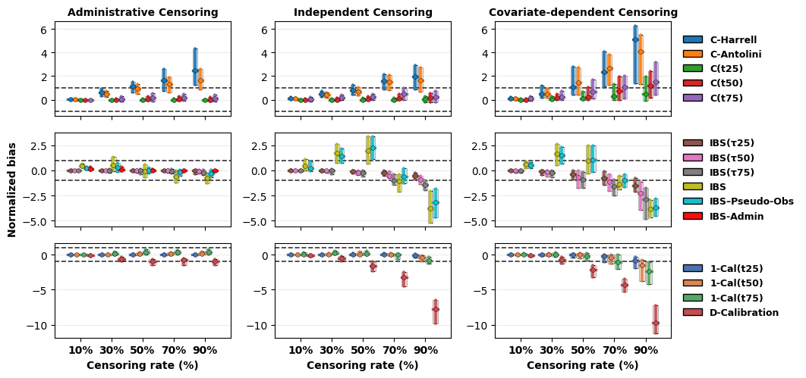
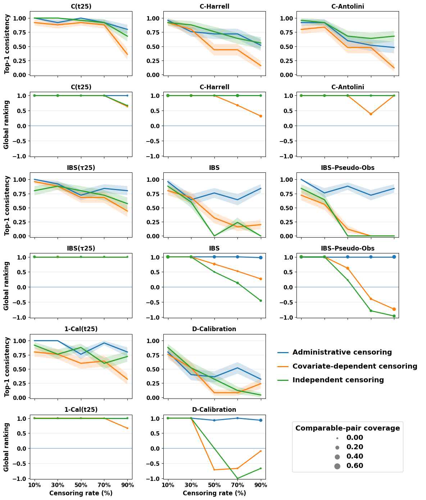

# When Can We Trust Survival Model Evaluation?

Official implementation for the ICML paper **"When Can We Trust Survival Model Evaluation?"**

This repository contains the experimental framework used to study how censoring affects survival model evaluation. The paper is available as [paper.pdf](paper.pdf).

## Overview

Evaluating survival models is difficult because test data are often right-censored: for some individuals, we know only that the event did not happen before a censoring time. Standard survival metrics try to account for this, but their reliability can still depend strongly on how much censoring is present and how censoring was generated.

The core idea of this work is to create controlled semi-synthetic censored datasets where the true event times remain available. This lets us compare two evaluations of the same trained model:

- `standard`: the usual evaluation using censored observations.
- `true_time`: an oracle evaluation using the fully observed event times.

The gap between these two evaluations isolates how censoring distorts metric values and model rankings. The main paper figures below summarize the two central outcomes: metric bias and ranking preservation.

## Key Findings

The experiments study major survival metric families, including concordance-based metrics, Brier-score/IBS metrics, and calibration metrics, across censoring rates and censoring mechanisms.



Main takeaways:

- Censoring rate is the dominant source of evaluation distortion.
- Censoring mechanism determines the failure mode; covariate-dependent censoring is especially damaging.
- Top-1 "best model" conclusions can be fragile even when global rankings are mostly preserved.
- Early-horizon or truncated metrics are often more stable under substantial censoring, but no metric is universally reliable.



## Repository Structure

```text
.
|-- all_models.py          # Model training, nested CV, prediction, and evaluation
|-- load_data.py           # Dataset loading and feature-column selection
|-- run_experiment.py      # Command-line experiment launcher
|-- utils.py               # Shared metric and preprocessing utilities
|-- data/                  # Prepared semi-synthetic datasets
|-- figures/               # README figures copied from the paper
|-- predictions/           # Saved survival predictions, created when experiments run
`-- results/               # Saved metric tables, created when experiments run
```

## Installation

The project uses `uv` and includes a lockfile:

```bash
uv sync
```

If you are not using `uv`, install the dependencies from `pyproject.toml` in a Python environment with Python 3.10 or newer.

## Data Format

Experiments expect prepared CSV files under:

```text
data/{dataset_name}/{dataset_name}_{censoring_level}_repl_{replication}.csv
```

For example:

```text
data/metabric/metabric_30_repl_1.csv
```

Each CSV must contain:

| Column | Type | Meaning |
| --- | --- | --- |
| `time` | numeric | Observed event or censoring time |
| `event` | integer | Event indicator, where `1` means observed event and `0` means censored |
| `true_time` | numeric | Fully observed event time, used only for oracle evaluation |
| other numeric columns | numeric | Covariates used as model features |

The paper experiments use controlled censoring across multiple public survival datasets. The runner itself works with any dataset that follows the file naming convention and column schema above.

## Running Experiments

Run one model on one dataset and censoring level:

```bash
uv run python run_experiment.py \
  --dataset metabric \
  --model rsf \
  --censorship 30 \
  --n_trials 10 \
  --n_outer 5 \
  --n_inner 3 \
  --replications 5
```

Available model names:

| Model | CLI name | Library |
| --- | --- | --- |
| Cox proportional hazards | `coxph` | `lifelines` |
| Weibull AFT | `weibull`, `weibull_aft`, `aft` | `lifelines` |
| Random Survival Forest | `rsf` | `scikit-survival` |
| Neural Multi-Task Logistic Regression | `nmtlr` | `pycox` |
| DeepHit | `deephit` | `pycox` |

Useful arguments:

| Argument | Meaning |
| --- | --- |
| `--dataset` | Dataset name, matching a folder in `data/` |
| `--model` | Model to train and evaluate |
| `--censorship` | Target censoring level used in the prepared CSV filename |
| `--n_trials` | Number of Optuna trials for hyperparameter tuning |
| `--n_outer` | Number of outer cross-validation folds |
| `--n_inner` | Number of inner cross-validation folds |
| `--replications` | Number of independent dataset replications to run |
| `--force_test_censoring` | Optional flag to force high censoring in outer test folds |

Note: the command-line flag is named `--censorship` in the code, but it refers to the censoring level.

## Outputs

Metric results are written to:

```text
results/res_{dataset_name}/{dataset_name}_{model}.csv
```

Survival predictions and test-fold metadata are written to:

```text
predictions/pred_{dataset_name}_{censorship}/
```

Each results row corresponds to one outer fold from one replication. Metrics are computed twice:

- `evaluation_type = standard`: metrics computed using observed censored test data.
- `evaluation_type = true_time`: oracle metrics computed by replacing censored observations with their true event times.

Typical metric columns include concordance, Brier/IBS, calibration, and error-based summaries, together with metadata such as fold, replication, dataset, censoring level, and evaluation type.

## Batch Runs

The repository includes `submitt_all_jobs.sh` as a scheduler helper for launching many dataset/censoring configurations for a single model:

```bash
bash submitt_all_jobs.sh rsf
```

This script currently calls `qsub`, so adapt it to your cluster or scheduler before using it. For local runs, use `run_experiment.py` directly as shown above.

## Reproducibility Notes

- `true_time` is used only for oracle evaluation, never for model training.
- Numeric covariates are selected automatically from the dataset after excluding `time`, `event`, and `true_time`.
- Saved prediction files make fold-level evaluation traceable.
- Fixed seeds are used throughout the training and splitting code where applicable.

## Citation

Citation information will be added once the final proceedings metadata are available.
